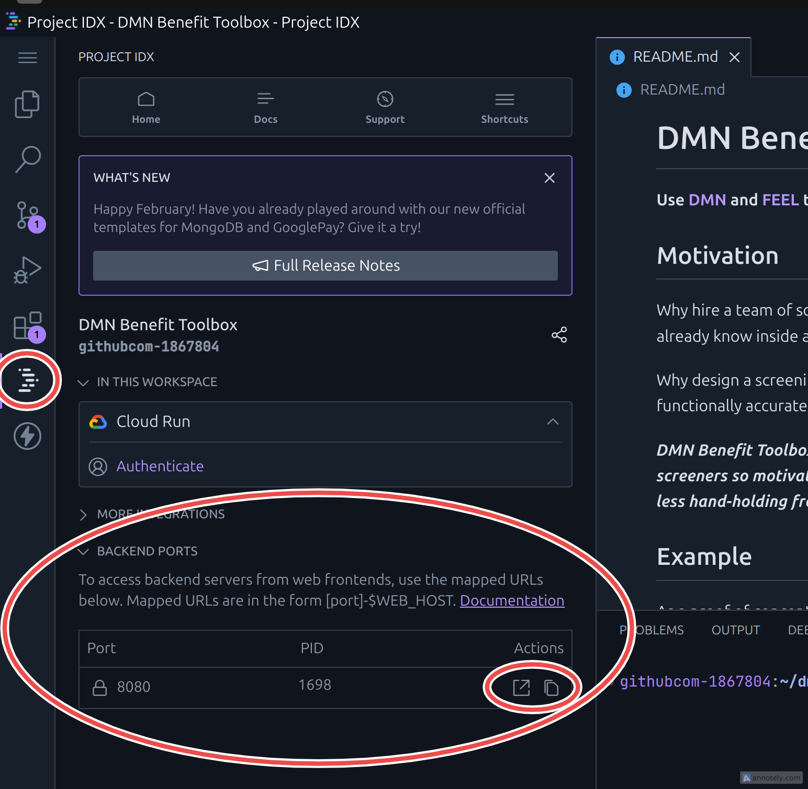

# DMN Benefit Toolbox

**Use [DMN](https://www.omg.org/dmn/) and [FEEL](https://docs.camunda.io/docs/components/modeler/feel/what-is-feel/) to create APIs and Screeners for public benefit rules.**

## Motivation

Why hire a team of software engineers to codify rules that your benefit experts already know inside and out?

Why design a screening tool from scratch when your goal is simply to deploy a functionally accurate service as quickly as possible?

***DMN Benefit Toolbox simplifies the management of eligibility rules and screeners so motivated subject matter experts can create useful tools with less hand-holding from traditional software teams.***

## Examples

### The Philly Property Tax Relief Screener

As a proof of concept, we've built a screener for several of the [tax relief benefits available in Philadelphia](https://www.phila.gov/services/payments-assistance-taxes/taxes/property-and-real-estate-taxes/get-real-estate-tax-relief/).

You can interact with the screener yourself at: https://phillypropertytaxrelief.org.

### JSON ("REST") API

A JSON API is generated from the eligibility rules created in DMN/FEEL. You can interact with the endpoints of this API at: https://phillypropertytaxrelief.org/q/swagger-ui/

## Setup a Development Environment

Since the ultimate goal of this project is to enable a development environment that is accessible to those without a software engineering background, we are intrigued by tools like [Project IDX](https://idx.dev/#introduction) as a precursor/mockup for a more specialized service that we'd like to build (eventually).

With IDX, the environment is in the cloud, and can be accessed from any computer without any manual setup.

If you're an experienced engineer, however, you may want to skip IDX in favor of your own preferred setup. (Up to you.)

### Use Project IDX (simplest)

The easiest way to get a feel for DMN Benefit Toolbox is to [fork this repo*](https://github.com/prestoncabe/dmn-benefit-toolbox/fork) and then open it (from the fork!) in Project IDX:

<a href="https://idx.google.com/import?url=https%3A%2F%2Fgithub.com%2Fprestoncabe%2Fdmn-benefit-toolbox">
  <picture>
    <source
      media="(prefers-color-scheme: dark)"
      srcset="https://cdn.idx.dev/btn/open_dark_32.svg">
    <source
      media="(prefers-color-scheme: light)"
      srcset="https://cdn.idx.dev/btn/open_light_32.svg">
    
  </picture>
</a>

When you open DMN Benefit Toolbox in IDX, a development machine will be created and configured for you in the cloud. (This will take a few minutes.)

After the first time you open the project, you can just return to idx.google.com to pick up where you left off.

_*Note on forking: you can skip this step if you are just curious or otherwise don't intend to contribute changes back to the project._

### Use Devbox (medium simple)

The second easiest way to get started is to [fork this repo](https://github.com/prestoncabe/dmn-benefit-toolbox/fork), clone it to your local machine, and use the included Devbox configuration:

[Devbox](https://www.jetify.com/devbox) is a way to create isolated development environments on your own machine.

We're experimenting w/ Devbox for the same reason we're experimenting w/ IDX; we're interested in how this approach to managing development environments could form the basis of some future specialized/packaged toolkit.

### Roll your own (for experienced developers)

Of course, you can also manually setup a laptop/desktop to work on DMN Benefit Toolbox, but it isn't recommended unless you really know what you're doing.

### Additional setup notes

#### Forms development

If you're planning to develop forms (the basis of eligibility screeners) in addition to eligibility rules, then you'll also need to download [Camunda Modeler](https://camunda.com/download/modeler/).

#### Kicking the tires and testing your work

You can run `bin/dev`* from a terminal to start the Quarkus development server. This will serve the API and any existing eligibility screeners from `https://localhost:8080`**.

*_If you are using Project IDX the Quarkus dev server should automatically start when you load the workspace._

**_Since Project IDX is a browser-based environment, the system will map the URL for the dev server to an address you can reach from a browser in your local machine. You can access this address by clicking on the IDX logo in the left sidebar, then clicking into the "Backend Ports" panel._

## Technologies overview

We use a combination of open-source tools ([Kogito](https://kogito.kie.org/) and [form-js](https://bpmn.io/toolkit/form-js/)) with some scaffolding to tie them together and make them easier to use.

Here are some high-level things to orient you...

### DMN Files

DMN files (`.dmn`) can be edited directly in VS Code via the [DMN Editor extension](https://marketplace.visualstudio.com/items?itemName=kie-group.dmn-vscode-extension). If you're using Project IDX as described above, then this extension is already installed for you. If you're using another dev environment, then you'll need to install the extension manually.

You may occasionally need to interact with the raw XML text of the DMN; this can be done via the "Reopen with Text Editor" feature of VS Code.

A good orientation on the basics of DMN can be found [here](https://learn-dmn-in-15-minutes.com/).

In this project, DMN (and its accompanying expression language FEEL) acts as the "source code" for a JSON web API. Kogito generates this API (with Java) when you run the Quarkus development server (automatic with Project IDX, or by running the `bin/dev` script).

### Form Files

Form files (`.form`) can be edited using [Camunda Modeler](https://camunda.com/download/modeler/). The modeler provides a UI for designing the form's layout and logic (which often incorporates FEEL expressions).

Behind the scenes,the form is saved in JSON format.

When it comes time to use the form in a screener, form-js interprets this JSON and uses it to display the form on a web page.

### Eligibility Screeners

To create the [Philadelphia Property Tax Relief Screener](https://phillypropertytaxrelief.org), we've written a [Qute template](https://quarkus.io/guides/qute) which displays the form, posts data as it is collected to the eligibility API (the one that is built from the DMN), and receives back eligibility results for display on the form.

For future screeners, we envision packaging up this functionality somehow, allowing the entire screening and results process to be included as part of other websites and tools, the content of which is outside the scope of this project.

## License
See the [LICENSE](https://github.com/prestoncabe/dmn-benefit-toolbox/blob/main/LICENSE.md) file for license rights and limitations (MIT).
